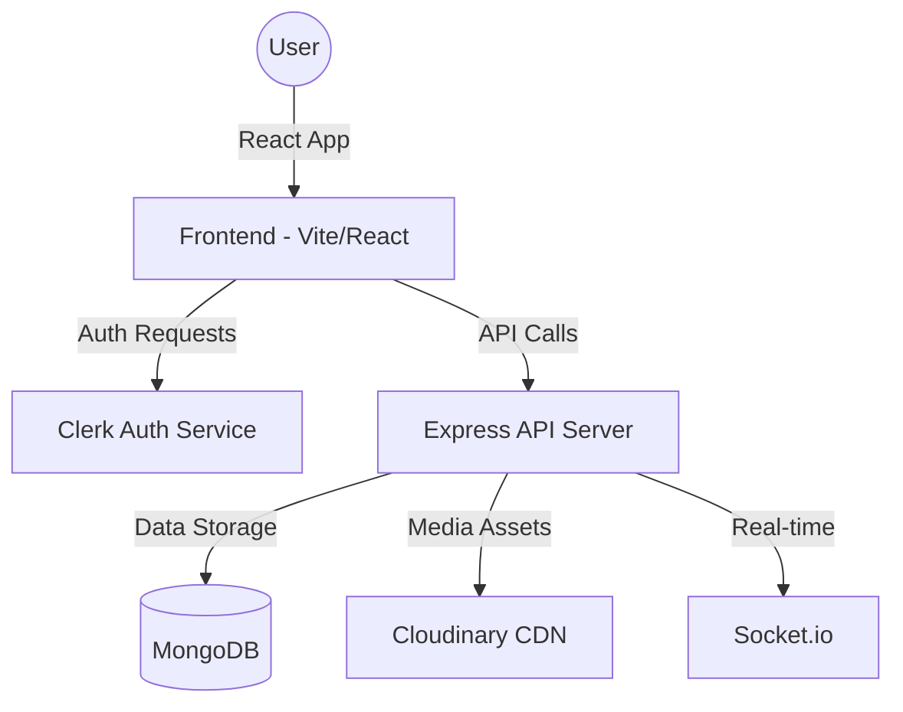

# Listny - Modern Music Streaming Platform

Listny is a high-performance, full-stack music streaming application built with a focus on scalability, modern UI/UX, and robust architecture. It features a React-based frontend using Feature-Sliced Design (FSD) and a Node.js/Express backend with MongoDB integration.

## 🚀 Key Features

- **Music Streaming:** High-quality audio playback with a custom-built Audio Player.
- **Library Management:** Create and manage playlists, like songs, and track your music history.
- **Smart Search:** Global search functionality for artists, albums, and songs.
- **Admin Dashboard:** Comprehensive tools for managing the music catalog, users, and platform stats.
- **Social Integration:** (Planned/Partial) Real-time interactions and music sharing.
- **Advanced Data Management:** Custom scripts for importing large datasets and seeding the platform.

---

## 🏗️ System Architecture

### Frontend: Feature-Sliced Design (FSD)
The frontend is organized using **FSD**, which ensures a clear separation of concerns and high maintainability.

- **`src/app`**: Global providers, styles, and entry points.
- **`src/features`**: Business logic partitioned by feature (Auth, Library, Songs, etc.).
- **`src/components`**: UI components categorized into `ui` (atoms), `shared` (molecules), and `layout`.
- **`src/lib`**: Shared utilities and the core API client.

### Backend: Service-Oriented MVC
The backend follows a structured MVC pattern enhanced with a Service layer to isolate business logic.

- **Controllers**: Handle HTTP requests and orchestrate responses.
- **Services**: Contain core business logic (e.g., complex song processing).
- **Models**: Mongoose schemas for MongoDB.
- **Middleware**: Authentication, validation (Joi), and error handling.

---

## 🛠️ Tech Stack

### Frontend
| Package | Purpose |
| :--- | :--- |
| **React 19 + Vite** | High-performance UI library and build tool. |
| **TypeScript** | Strict typing for enterprise-grade reliability. |
| **TailwindCSS + Shadcn UI** | Utility-first styling with accessible, modern components. |
| **TanStack Query** | State-of-the-art server-state management and caching. |
| **Clerk React** | Enterprise-level authentication and user management. |
| **Axios** | Robust HTTP client for API interactions. |
| **Lucide React** | Consistent and clean iconography. |

### Backend
| Package | Purpose |
| :--- | :--- |
| **Express.js** | Minimalist and flexible web framework. |
| **MongoDB + Mongoose** | NoSQL database with elegant schema modeling. |
| **Cloudinary** | Scalable cloud storage for audio and image assets. |
| **Socket.io** | Real-time bi-directional communication. |
| **Swagger** | Interactive API documentation (OpenAPI). |
| **BcryptJS + JWT** | Secure password hashing and token-based auth. |
| **Joi** | Powerful schema description and data validation. |

---

## 📊 System Overview



---

## 🛠️ Getting Started

### Prerequisites
- Node.js (v20+)
- MongoDB (Local or Atlas)
- Cloudinary Account
- Clerk Account

### Installation

1. **Clone the repository:**
   ```bash
   git clone https://github.com/username/listny.git
   cd listny
   ```

2. **Backend Setup:**
   ```bash
   cd backend
   npm install
   # Create .env based on documentation
   npm run dev
   ```

3. **Frontend Setup:**
   ```bash
   cd frontend
   npm install
   # Create .env based on .env.example
   npm run dev
   ```

### Dataset Import
To seed the database with the initial music dataset:
```bash
cd backend
npm run import-dataset
```

---

## 🛡️ Privacy & Security

Listny is designed with a "Security First" mindset:
- **Environment Isolation:** Sensitive keys are never committed to source control.
- **Data Validation:** Every API endpoint is protected by Joi schemas to prevent injection and malformed data.
- **Rate Limiting:** (In Production) Protects against brute-force attacks.
- **Asset Privacy:** Cloudinary links are signed and securely managed.

---

## 📖 Documentation

The backend includes a fully-featured **Swagger** documentation. Once the backend is running, visit:
`http://localhost:5000/api-docs`

---

## 🤝 Contribution

Contributions are welcome! Please ensure you follow the **Feature-Sliced Design** conventions when making frontend changes and use the provided **Services** layer for backend logic.

1. Create a feature branch.
2. Commit changes with descriptive messages.
3. Open a Pull Request for review.

---

*Built with ❤️ by the Listny Team.*
3